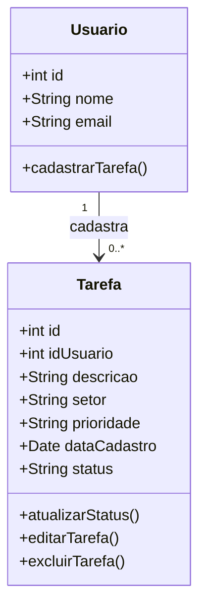
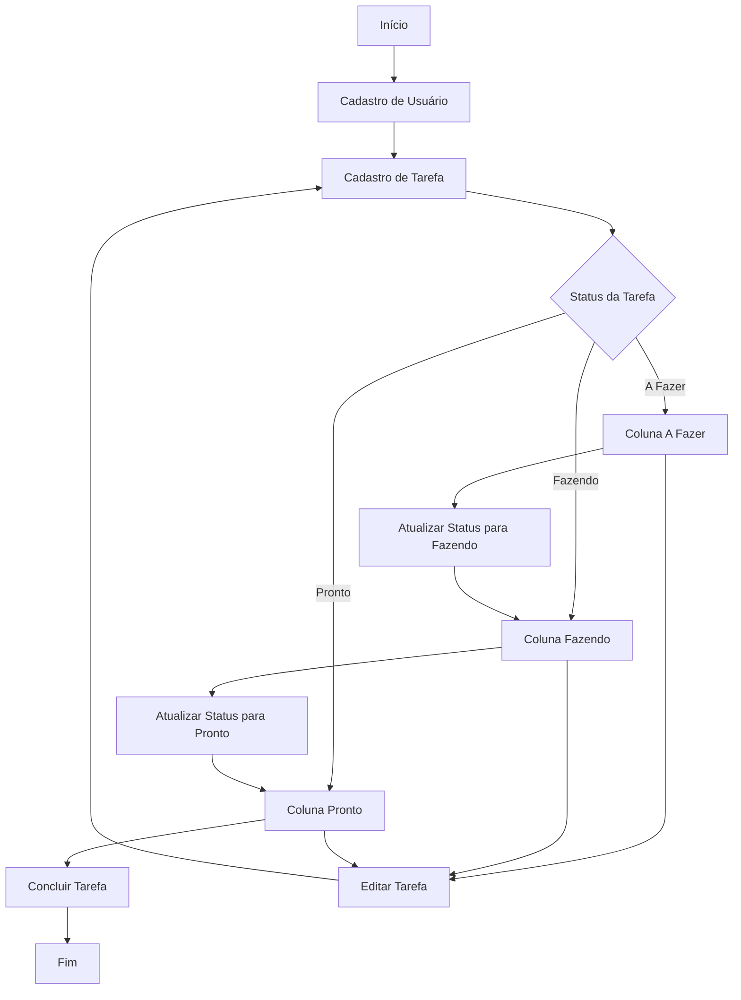

### Diagramas

1. Classe



  2. Uso
```mermaid
  usecaseDiagram
    actor Usuario as "Usuário"
    actor Admin as "Admin (Opcional)"

    Usuario --> (Cadastrar Tarefa)
    Usuario --> (Atualizar Status da Tarefa)
    Usuario --> (Editar Tarefa)
    Usuario --> (Excluir Tarefa)
    Admin --> (Gerenciar Usuários)

    (Cadastrar Tarefa) --> (Visualizar Tarefa)
    (Atualizar Status da Tarefa) --> (Visualizar Tarefa)
    (Editar Tarefa) --> (Visualizar Tarefa)
    (Excluir Tarefa) --> (Visualizar Tarefa)


```

  3. Fluxo
