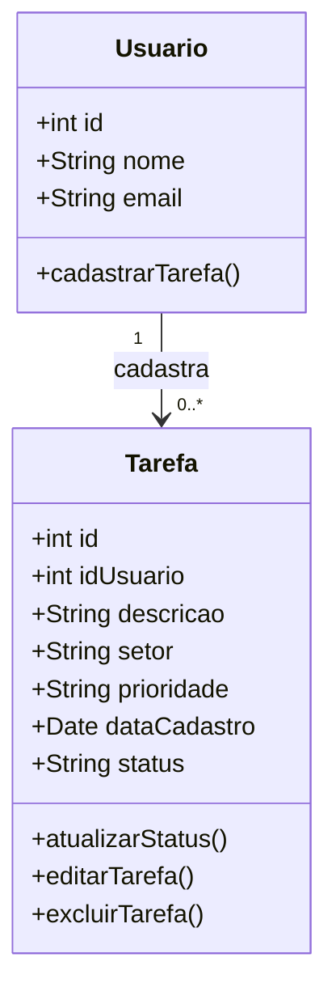
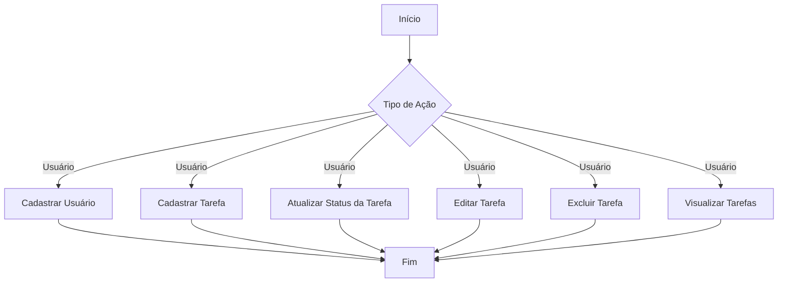
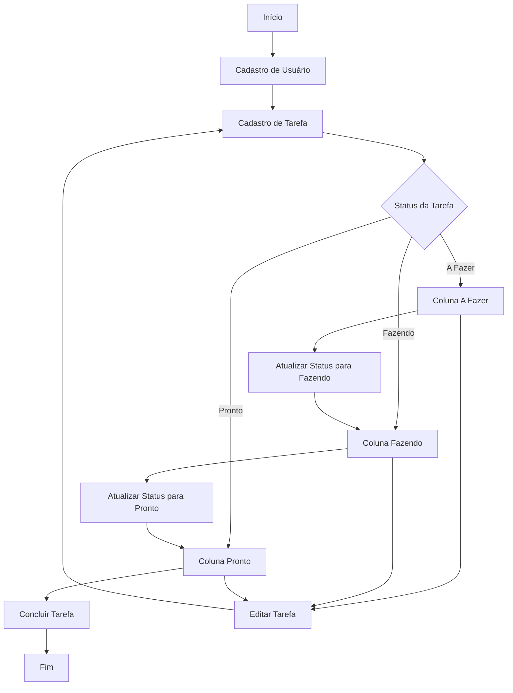

### Diagramas

1. Classe

```mermaid
classDiagram
    class Usuario {
        +int id
        +String nome
        +String email
        +cadastrarTarefa()
    }

    class Tarefa {
        +int id
        +int idUsuario
        +String descricao
        +String setor
        +String prioridade
        +Date dataCadastro
        +String status
        +atualizarStatus()
        +editarTarefa()
        +excluirTarefa()
    }

    Usuario "1" --> "0..*" Tarefa : cadastra

```

  2. Uso

```mermaid
  flowchart TD
    A[Início] --> B{Tipo de Ação}

    B -->|Usuário| C[Cadastrar Usuário]
    B -->|Usuário| D[Cadastrar Tarefa]
    B -->|Usuário| E[Atualizar Status da Tarefa]
    B -->|Usuário| F[Editar Tarefa]
    B -->|Usuário| G[Excluir Tarefa]
    B -->|Usuário| H[Visualizar Tarefas]

    C --> I[Fim]
    D --> I
    E --> I
    F --> I
    G --> I
    H --> I


```

  3. Fluxo

```mermaid
   flowchart TD
    A[Início] --> B[Cadastro de Usuário]
    B --> C[Cadastro de Tarefa]
    C --> D{Status da Tarefa}

    D --> |A Fazer| E[Coluna A Fazer]
    D --> |Fazendo| F[Coluna Fazendo]
    D --> |Pronto| G[Coluna Pronto]

    E --> H[Atualizar Status para Fazendo]
    F --> I[Atualizar Status para Pronto]
    G --> J[Concluir Tarefa]

    H --> F
    I --> G
    J --> K[Fim]

    E --> L[Editar Tarefa]
    F --> L
    G --> L

    L --> C


```